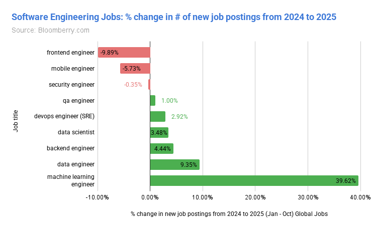

Currently, I work as a backend engineer. Thankfully, on based on what I read today---[180M jobs are analyzed to check whether it's getting replaced by AI](https://bloomberry.com/blog/i-analyzed-180m-jobs-to-see-what-jobs-ai-is-actually-replacing-today/)---my job is safe. Backend enginneer having a positive increase while frontend engineer is quite declining.

On the other side, creative roles are doing OK, such as creative director, creative managers, and creative producers roles are going positive, unlike the execution-roles.

Mundane jobs are getting scarcer each days as they are getting replaced by AI and technologies. It's been like this since the industrialization era started. Everything are getting easier and easier that easy jobs always getting replaced by AI.

### Software Engineering Jobs

I think I'm on the right track. Learning AI + Rust is the best way possible to secure a new job in the future.

Throughout history, humans have survived industrial revolutions by adapting their work and utilizing the available tools of each era. 

But now, it's kind of different. When LLM emerged and getting better each day, everything has changed: human behavior, unemployment rate, stock market, technology, and much more! When industry 2.0 started, people were getting replaced by machine. Many people who usually did the job manually (like the jobs in factory) saw their roles became automated and less people involved. Each industrial revolution caused jobs to involve fewer and fewer people. But they survived. 

This era is different. It's brutal. Machines were meant to assist humans. But now? The existence of AI enhances the possibility of actually ***replace*** humans. It's even worse if we consider that the earth is home to 8 billion people, unlike a century ago when earth population was only 1-2 billion people.

We have to survive.