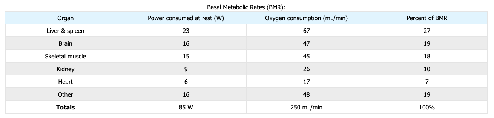

In this universe, the total amount of energy is constant. It never increase or decrease, they just spread out to become more and more messy. This is what we call [entropy](../thermodynamics/index.md).

The rate at which body convert energy from food sources to do activities is called metabolic rate. When the person is resting, the rate is called ***basal metabolic rate*** (BMR).

### How to calculate BMR

Formula:

For men: (10 * weight) + (6.25 * height) + (5 * age) + 5
For women: (10 * weight) + (6.25 * height) + (5 * age) - 161

Example:

Weight: 50
Age: 20
Height: 170
Gender: Men

Result: 10 * 50 + 6.25 * 170 + 5 * 20 + 5 = 500 + 1067.5 + 100 + 5 = **1667.5 calories/day**

### How energy from food converted to our energy

Food we consume has energy, digested with enzymes. Karbohidrat dipecah menjadi simple sugar, glukosa. dan sukrosa. Mostly happens in small intestine. And then it absorbed into the bloodstream. 

Nutrisi itu ga langsung diserap menjadi energi, tapi diubah dulu jadi Adenosine Triphosphate (ATP), "energy currency" of cells. Sel sel pada tubuh kita itu menyimpan energy. ATP is basically a recyclable battery, not the energy itself. It can be charged and discharged by proteins.

So how ATP is consumed is used by:
- BMR: 60-75% of energy
- Activity: 15-30% of energy
- Storage and adaptation: 5-10%

The excess energy will become fat as a stored energy. How does our body know whether they should store in fat?
Energy imbalance. If total intake (consumption) > expenditure (BMR, activity), the excess get stored. Our body has constant monitoring system via blood glucose and hormone levels.

BMR usage for each organs:

### Increased entropy

All the energy we used will always increase entropy. Like our body generates heat, the heat spread into the air.