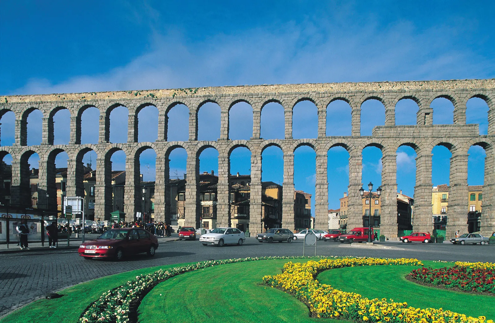
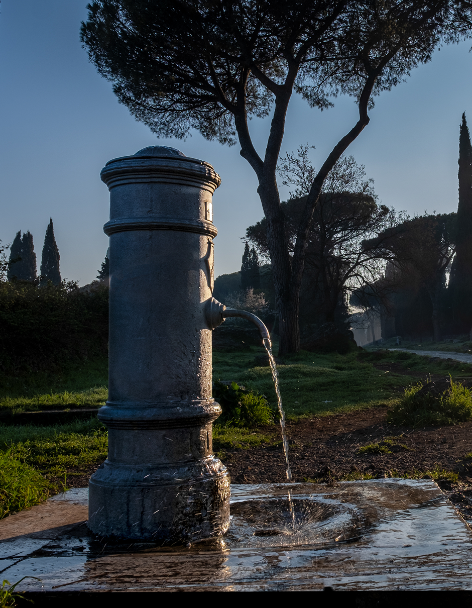

Since the ancient Roman times, Rome pioneered an extraordinary system to distribute water throughout the entire city. They developed an aqueduct, a bridge or tunnel to transport water from the mountains to homes.

These aqueducts harness the gravity, and what makes them truly remarkable is that every kilometre of aqueduct descends by a mere 50 centimeters.

Rome is also home for nasone, a free public water that runs 24/7 we can get. It's potable and refreshingly cool. It's named nasone because derives from the word "nose", as the spout shaped like one.

Vocab:

- spout: moncong
- remarkable: worth of notice, impressive
- pioneered: the first one to introduce, develop
- harness: use, utilize. to control or utilize human energy to produce something or achieve a goal
