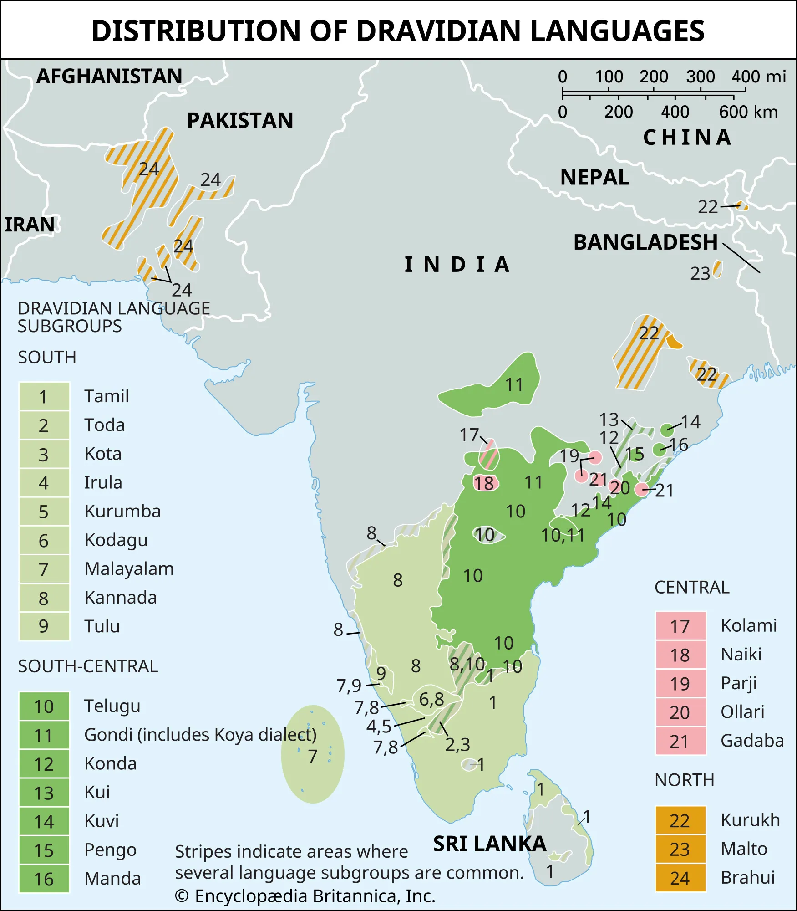

Dravidian languages are major family language native to South Asia, including Tamil, Telugu, Kannada, Malayalam.

"Dravid-" is a cognate of "Tamil" in Sanskrit. The reason why it's called Dravidian and not Tamilian is because Dravidian refers to a language family, meanwhile Tamil refers to a specific language.

