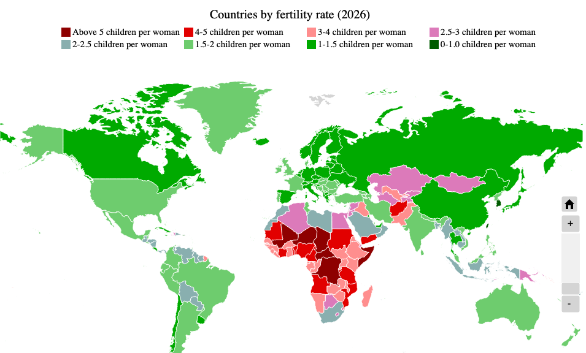

Fertility rate is how many birth per women in lifetime. As per 2026, Indonesia has fertility rate 2.08 children per woman. The countries with the highest fertility rate still hold by Chad (5.84), Somalia (5.81), and Democratic Republic of the Congo (5.80).

The world population starts shrinking when the Total Fertility Rate (TFR) is under 2.1. This number is called replacement level fertility, the exact number of child per woman to replace the parents. The population will not shrink the exact moment fertility rate drops below 2.1 due to "population momentum", the population will continue growing for several decades with fewer birth per person.

**Why 2.1, not 2.0?**

- Sex ratio is not balanced. There is 105 boys are born for every 100 girls.
- Many people choose to not have children
- Not every child born to reach their own reproductive years
- Extra 0.1 acts as a buffer

The peak population is predicted to be around 2060 to 2100 and The population in 2100 is expected to be 6% smaller.

Sources:

- https://statisticstimes.com/demographics/countries-by-fertility-rate.php
- https://www.un.org/en/global-issues/population
