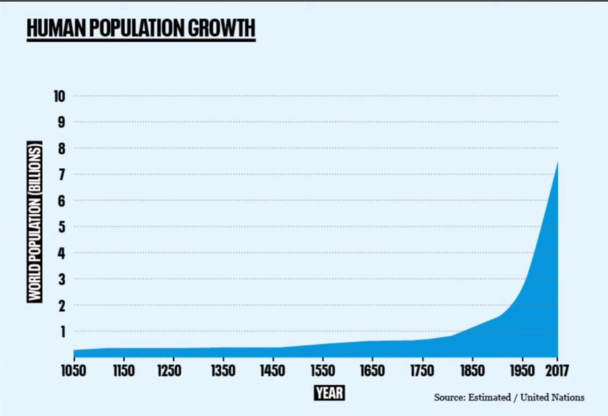

Mari kembali ke tahun ketika nenek moyang kita hidup. Di jaman itu, manusia hidup berkelompok untuk survive. Laki-laki dan perempuan saling bekerja sama untuk bertahan hidup. Considering the biological shape and function, perempuan dituntut untuk memperbanyak keturunan, sementara laki-laki ada untuk memusnahkan musuh untuk bertahan hidup. Makanya, laki-laki semakin kuat dan didorong untuk semakin kuat, sementara perempuan lemah secara fisik. Itu membentuk genetik yang turun temurun membentuk manusia pada zaman sekarang.

Laki-laki berburu dan berperang itu sebuah action untuk mempertahankan kelompoknya. Perempuan memperbanyak keturunan adalah bentuk dari memperbanyak sumber daya manusia. Semakin banyak anak, semakin tinggi pula chance untuk bertahan hidup. Anak yang banyak dapat membantu dalam perkebunan dan sawah lebih cepat dan efisien sehingga para laki-laki juga bisa survive.

Makanya, kala itu tujuan dari menikah adalah untuk bertahan hidup. Orang yang menikah saat itu bukan memilih sendiri pasangannya, tapi dipilihin kelompoknya. Karena tujuannya reproduksi, mereka menikah ketika usianya sebisa mungkin ketika masih sangat muda, atau bahkan belum puber, tapi hubungan seksual dilakukan setelah sel telur terbentuk (puber).

### Asal usul 'pernikahan'

1. Suatu hubungan yang didominasi laki-laki yang lebih kuat secara fisik dapat menyakiti perempuan.
2. Perempuan ketika bereproduksi itu akan menghilanngkan kemampuannya bertahan hidup secara independen.
3. Seluruh resiko yang ada pada hubungan itu perempuann yang nanggung.

Karena tiga hal di atas, makanya diciptakan konsep pernikahan. Pernikahan ini adalah perjanjian dimana pihak lelaki akan memberikan nafkah kepada istrinya seumur hidup, melindungi seumur hidup, dan memberikan cinta kasih seumur hidup. Itu adalah "tarif" yang wajar untuk perempuan. Makanya, walaupun pelacur artis itu dihargai uang 80 juta semalam, itu termasuk harga yang *terlalu murah*.

### Sejak kapan konsep 'menikah' ini berubah?

Sejak revolusi industri sekitar 1750an, kehidupan manusia berubah drastis. Banyak teknologi-teknologi yang memudahkan manusia untuk bertahan hidup. Sebelumnya, kita bergantung sama alam --- menunggu sawah dan perkebunan siap panen. Sementara pada zaman revolusi industri, semuanya 'direkayasa' oleh manusia. Sejak saat itu, populasi manusia meningkat pesat secara eksponensial sampai saat ini.

Kenapa bisa meningkat pesat? karena ilmu pengetahuan yang meningkat pesat --- diciptakannya obat dan vaksin yang meningkatkan *life expectancy* manusia dan menurunkan tingkat kematian.

That's why tujuan pernikahannya sekarang berubah --- yang awalnya nikah untuk bertahan hidup, mempertahankan kelompoknya --- menjadi nikah untuk mendapatkan **kebahagiaan**. Untuk mencapai itu, orang-orang jaman dulu itu melakukan 'pendekatan' sebelum pernikaah. Inilah yang disebut sebagai pacaran.

### Pacaran itu haram?

Pacaran jaman dulu, bukan mesra-mesraan, main ke bioskop dan melakukan hal-hal yang lucu. Kalau dulu, kalau dateng ke rumah cewe/cowo itu ditemenin orang tuanya untuk saling mengenal. Orang tuanya menginterogasi. Pendekatan ini memang bertujuan untuk menikah.

"Pacaran itu haram" itu baru muncul akhir-akhir ini, karena kultur pacaran itu belum ada di zaman Nabi Muhammad dan bahkan juga tidak tertulis di Al-Qur'an. Diharamkan itu karena jaman sekarang pacarannya seperti mendekati zina, sudah disebutkan dalam Al-Isra' ayat 32. 

### Arti pacaran bergeser

Selama abad ke-20, arti pacaran semakin bergeser. Pre-marital sex semakin dianggap normal, atau kita sebut *revolusi seksual*. Sejak saat itu, semakin penggambaran bahwa pacaran itu lumrah diterima oleh masyarakat ketika ditayangkan di TV, radio, dan majalah.

Ini juga semakin diwajarkan karena adanya alat kontrasepsi yang membuat manusia berpikir aktivitas sex itu bukan berarti bereproduksi. Makanya, beban untuk mengarahkan ke pernikahan itu semakin hambar. Sekarang pacaran itu kebanyakan untuk bersenang-senang, untuk menyenangkan dan memenuhi hasrat. Makanya pacaran itu diharamkan. Contohnya, anak SMP jaman sekarang pacaran, kalo ditanya tujuannya apa? mereka gak ada tujuannya, juga gak tau mau nikah kapan.

Usia pernikahan semakin naik. Di negara liberal seperti Amerika atau negara-negara Eropa, rata-rata umur pernikahan itu mencapai 30 atau lebih. Salah satu alasannya karena hasrat seksual mereka sudah bisa terpenuhi tanpa perlu komitmen pernikahan, jadi mereka tidak buru-buru menikah.

