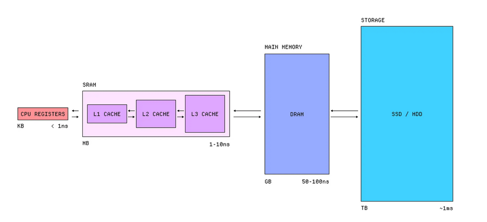

There are many place where we can store our data: CPU registers, Static Random Acces memory (SRAM), Dynamic Random Access Memory (DRAM), and Storage (SSD/HDD).

The closer the data is placed from CPU, the faster it is to read/write the data. Caches are a type of memory of SRAM. The fastest memory outside CPU registers is in L1 Cache which is super tiny, it holds 32KB to 128KB of data, but super fast with the access around 1ns. Meanwhile, L2 cache is bigger in size, typically around 256KB to 1MB, but slightly slower than L1. It also applies to L3 cache. 

CPU cache is expensive because to store a single bit, it requires multiple transistors. It acts as a bridge between the CPU and RAM.

Then there is DRAM. Instead of transistors, DRAM uses tiny capacitors to read an electric charge that we can read as a bit. It can compromise the speed of SRAM and the capacity of long term storage. 

And there is a storage where we can store a gigantic amount of data at the cost of speed: SSD and HDD.

Source: https://www.makingsoftware.com/chapters/how-is-data-stored
