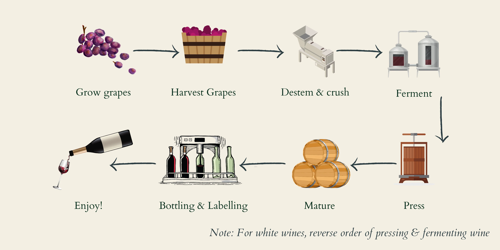

Grape is the main source for producing wine. It went through a biological process called **fermentation**. Fermentation occurs because the grape has yeast (ragi) in its skin. Grapes have a lot of sugar (glucose and fructose). So fermentation breaks down sugar, also the sugar molecules into three byproducts: Ethanol, CO2, and Heat. Ethanol is the alcohol that gives us kick.

When the yeast eats all the available sugar, it results in dry wine.

Source: https://witchesfalls.com.au/blogs/news/how-wine-is-made
