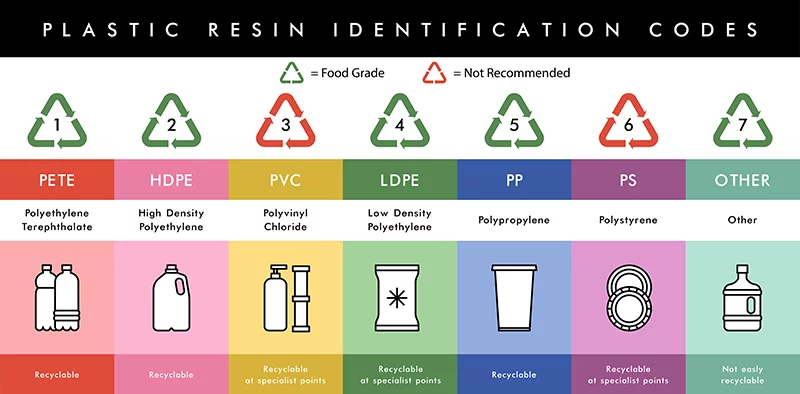

Food grade plastic is a certified plastic by FDA or BPOM that the plastic will not transmit harmful chemical.

It's BPA free, durable, and moisture-resistant. BPA free is a sign that the plastic does not contain Bisphenol A (BPA), a synthetic chemical that may disrupt hormones and health.

