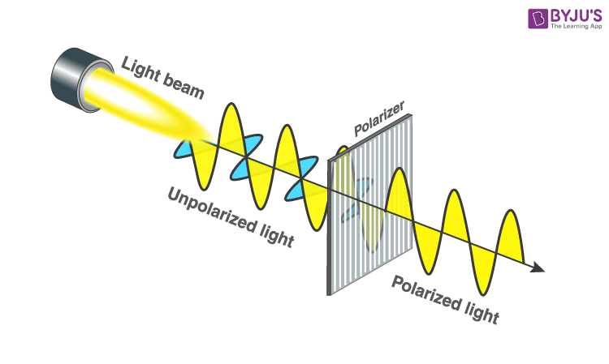

There are many benefits from using sunglasses. It blocks UV radiation and helps limit the amount of light coming to our eyes.

Cheap sunglasses is different from an 'actual' sunglasses. The one that is extremely cheap that we usually found in the street or market is probably fake (**beware of it!**) because it's just a simple plastic that is coated with thin tinted coating on them.

Sunglasses also blocks specific spectrum of light, like the ultraviolet radiation---an electromagnetic radiation that is roughly between 100 to 400 nm.

There are technologies that are used to make a sunglass: tinting, polarization, photochromic lenses, mirroring, anti-reflective coating, and UV coating.

Tints determine what part of light spectrum that are absorbed by the lenses. Gray tints protect from glares, yellow tints reduces the amount of blue light in a high percentage.

Polarization. Light that comes from sun or light bulb, it radiates outward in all directions. When the light is transmitted or reflected, it is polarized. Polarization can happens naturally or artificially. We can see the light is polarized every time we look at the lake. It's also the reason why we can't see (or can barely see) below the surface.

A polarized filter only allow the light wave that is allowed. Most of the glare comes from horizontal surfaces. Lake produces horizontally polarized light. So, polarization in a sunglass are fixed at an angle that only allows vertically polarized light.

## UV-A and UV-B

Our eyes absorb all of the UV-B and most of UV-A. Over the time, this absorption can leads to cataracts. So, good UV coating can filters all the UV and prevent UV lights to enter our eye.
