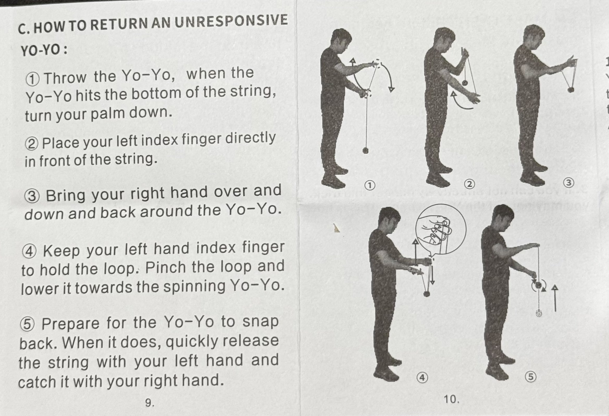

Today I learned how to play Yoyo.

- I learned how to [attach yoyo string](https://www.youtube.com/watch?v=jJrtgrGmZQk)
- I learned how to bind a yoyo (return a yoyo to hand) from [this video](https://www.youtube.com/watch?v=lAtGnUtv6Ps)

### Unresponsive vs Responsive Yoyo

Responsive yoyo is a yoyo that returns to hand when you tug on it. In contrast, unresponsive yoyo will not return to hand when you tug on it. To put a unresponsive yoyo back to hand we need to do what's called **bind**.

Responsive yoyo is better for beginner as it's easy to play. On the other side, unresponsive yoyo is better to do more advance tricks because they spin longer.

Unfortunately, I didn't know all of these, so I accidentally bought an unresponsive yoyo as a very first time yoyo player, so I learned the hard way.

