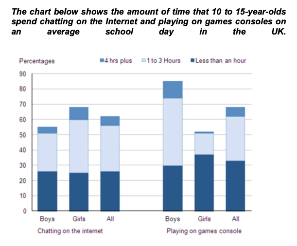

The bar chart compares the average time spent by 10 to 15-year-olds in the UK in two activities, chatting online and playing console games.

Overall, we can see that playing console games is slightly more popular than chatting online. But girls and boys have different data.

According to the chart, over 85% of boys play console games every day, while only 51% of girls play console games daily. Furthermore, the majority of boys play their consoles more than one hour a day, while the majority of girls spend less than an hour a day.

By contrast, chatting on the internet is more popular for girls. Close to 70% 10 to 15-year-olds girls engage in online conversation each day, compared to about 55% boys engagement on online chatting. The majority of girls spend 1 to 3 hours on chatting online and less than 10% who spend more than 4 hours a day.
