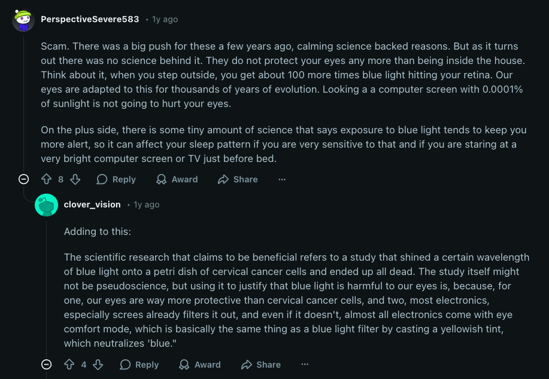

Blue light dari LCD itu memang ada, tapi kacamata anti radiasi itu "mostly" gimmick. Beberapa alasannya:

1. Blue light dari layar itu gak bikin eye-strain atau kerusakan di mata
2. Yang bikin eye-strain itu brightness dan kebiasaan kita. Contohnya, jarang kedip yang bisa bikin mata kering, kita cenderung kedip lebih sedikit di depan layar. Lalu penglihatan yang terfokus pada satu titik yang dekat dalam waktu yang lama, bikin otot mata pegel.
3. Layar LCD modern itu gak emit radiasi bahaya
4. Blue light dari matahari itu jauh lebih banyak dibandingkan layar LCD.
5. American Academy of Opthalmology (AAO) gak ngerekomenin kacamata anti-blue light karena kurangnya bukti ilmiah yang mendukung.
6. Kacamata anti radiasi ini rata-rata hanya ngeblock 10-20% blue light (kuning sedikit). Kalo mau bener-bener ngeblock blue light itu pasti kacamatanya bakal kuning banget.
7. Placebo trap! Cuma karena kita beli kacamata anti radiasi, kita jadi cenderung lebih care sama kesehatan mata kita. Kita jadi lebih sering kedip dan istirahatin mata.

## Tapi ada satu pengecualian

Blue light itu ngedisrupt circadian rhytm kita. Melatonin (*sleep hormone*) kena suppress gara-gara adanya blue light. Makanya, kita lebih unlikely untuk tidur siang karena terpapar sinar matahari yang emit cukup banyak blue light.

Nyalain 'night mode' atau pake kacamata "anti radiasi" itu cukup membantu untuk ini. 
