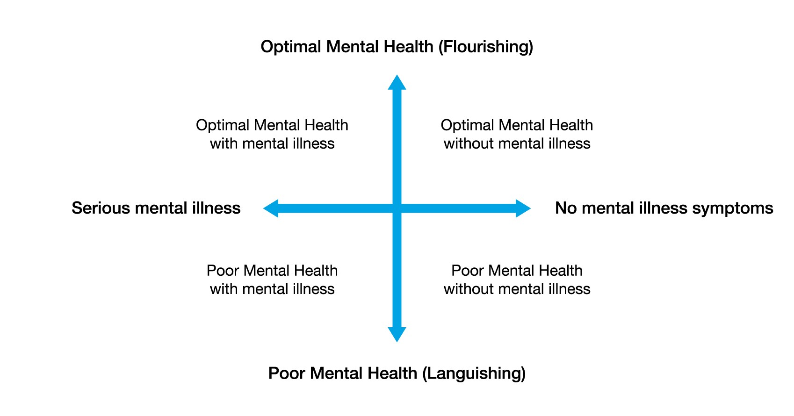

Languising is a term coined by sociologist Core Keyes, when someone lays on the middle part of psychology spectrum, neither depression or flourishing. Life feels flat, stagnant, and empty.

He also developed the model "Two Continua Model" which explains that mental illness and mental health is a related but two distinct dimensions. You can have no mental illness but with poor mental health. You can also have a great mental health with mental illness.

The four quadrants of mental health:

- Flourishing: High mental health and low mental illness.
- Struggling: High mental health and high mental illness.
- Languishing: Low mental health and low mental illness.
- Floundering/Illness: Low mental health and high mental illness.
