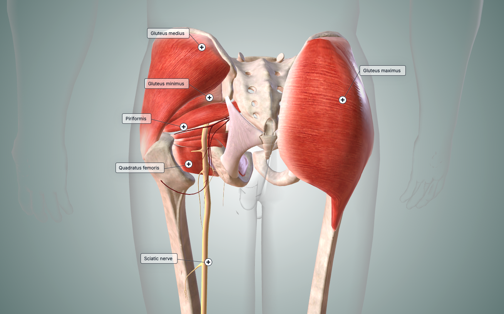

## The Gluteal Region

In the gluteal area, there are layers in the superficial muscles: Gluteus Maximus, Gluteus Medius, and Gluteus Minimus.

Gluteus Maximus is the most superficial layer which produce the shape of the buttocks. It's only used when force is required like climbing or running.

It gets deeper to Gluteus Medius and Gluteus Minimus. Both stabilises the pelvis during locomotion.

There is also tensor fascia lata, the muscles located in the outer side of the hip that helps leg to move outward and stabilises when standing on one knee,

