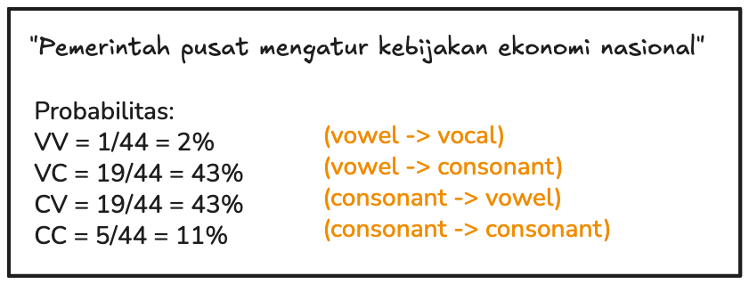
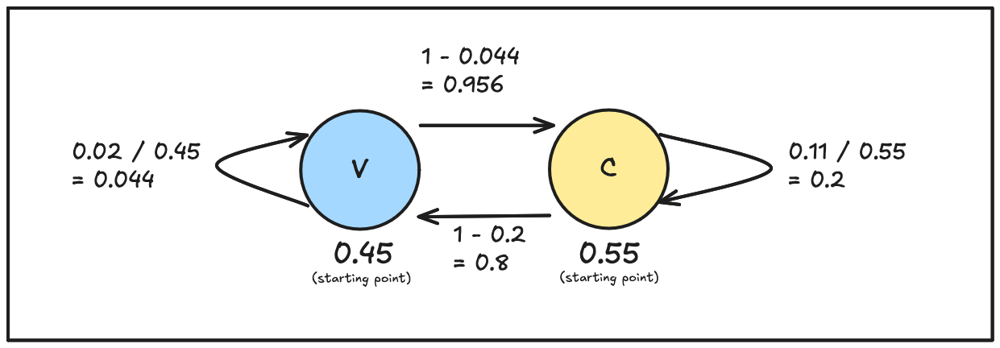

Markov Chain is a prediction model that proves that dependent events can follow the [law of large numbers](../law-of-large-numbers/index.md).

## History

In Russia, people are divided into two groups: Tsarist and Socialist. Tsarist wants their political system to be continued and Socialist wants political reform. This was so bad that mathematicians even start picking sides. Nekrasov was tsarist and Markov was socialist.

Nekrasov thinks that even free will can follow the law of the large numbers. And then Markov trying to prove that law of large numbers also valid with dependent values.

## Example

Take an example "Pemerintah pusat mengatur kebijakan ekonomi nasional", kalimat ini mempunyai 45% vokal (V) dan 55% konsonan (C). By combining this two combinations, we have four combinations: VV, VC, CV, CC. 

Having that probability numbers, we can calculate the probability of dependent events with markov chain:

If we use this chain over and over again to predict the next letter, the more letters we have, the probability of letters appear will converge to 45% for vowels and 55% for consonants.

Thus, Markov found a way to calculate probability with dependent events. This is a huge breakthrough.

## Almost all events in the world are dependent

Like weather prediction, weather tomorrow dependent on weather today. stock market trends, web navigation patterns, and everything that needs pattern recognition.