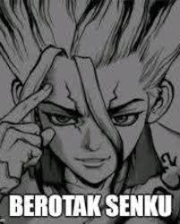

Microexpression is an involuntary facial expression that happens in a very quick time, usually only lasts fraction of a second. It reveals the emotions that people are trying to hide. It is also impossible to control.

For example, when we feel disgust and we want hide it, the face will make the microexpression for a fraction second and then you gain back the facial control. Microexpression will still revealed on your face unless you're experienced enough to hide your emotions as a whole.

For example:

1. Disgust: Nose wrinkling, upper lip raising
2. Anger: Brows lowered, lip tighten
3. Fear: Mouth slightly stretch, upper eyelid up
4. Surprise: Brows up, jaw drop
5. Happiness: cheeks lifted, muscles around the eye tighten
6. Sadness: lip corner lowered, brows raised
7. Contempt: one side of lip raised (sneer)

