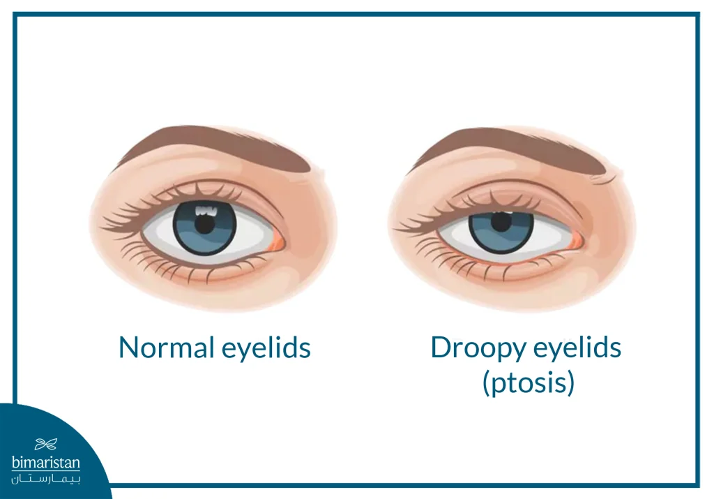

Microsleep is a short period of time when our brain are involuntarily inactive while appearing to be awake. We feel zoned out and lose consciousness.

It commonly happens while driving because it's an activity with physical stillness and our body is relaxed on the comfortable driver seat.

Signs are sudden head nodding, long empty stare, and drooping.

## How to avoid microsleep while driving?

1. Bring a passenger, ask them to actively talk with you.
2. Play an interactive or engaging music, podcasts, or upbeat music.
3. Drink coffee then nap for 20 mins
4. Take breaks, pull over every 2 hours or 100km.
5. Have enough sleep.
6. Avoid antihistamines.
7. Avoid driving on your usual sleep time.
