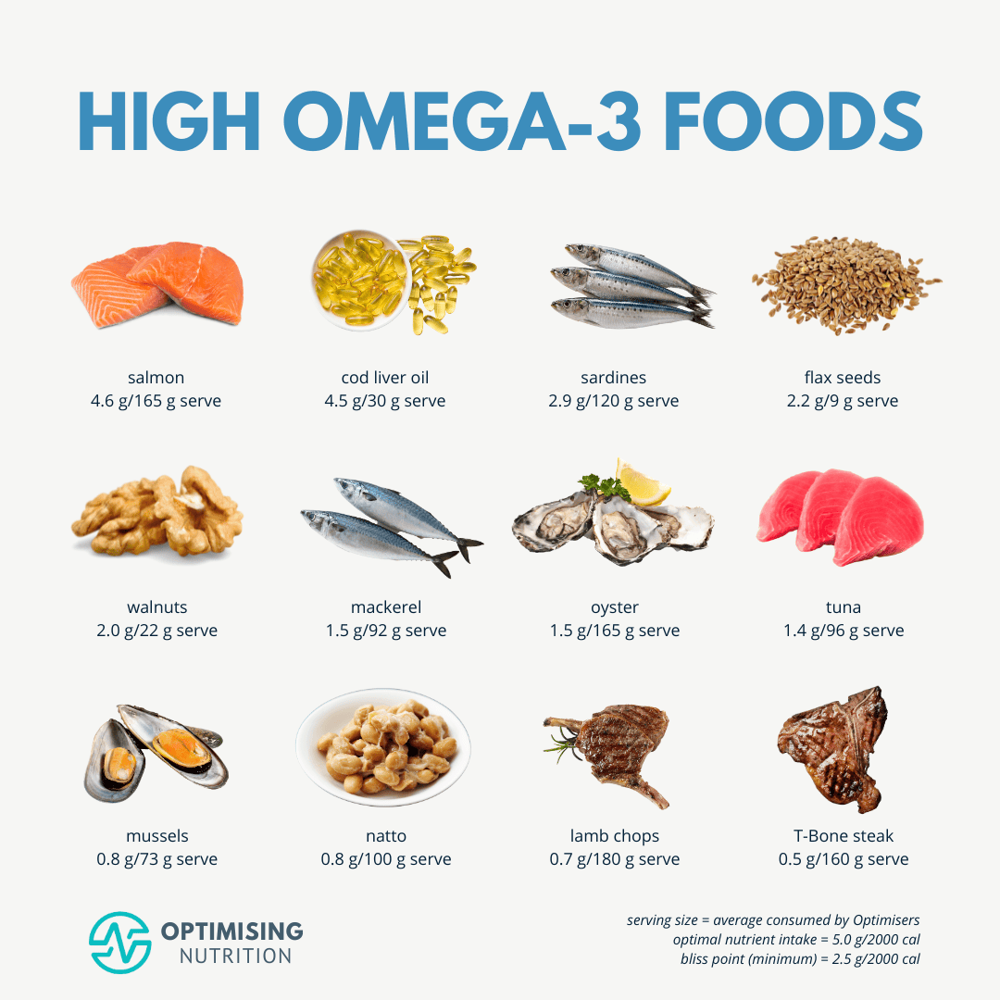

Today I learned that Omega 3 is anti-inflammatory and Omega 6 is pro-inflammatory (if consumed in excess). Your body does not produce them, you must get them from diet.

Omega-3 has Eicosapentaenoic Acid (EPA) and Docosahexaenoic Acid (DHA) as the core components. EPA is known as the anti-inflammatory. DHA is known for retina and brain health that is essential for cognitive function.

What you need to do is to increase omega-3 and decrease omega-6 consumption.

**Omega-3 benefits:**

- Promotes brain health
- Improves heart health
- Reduces inflammation
- Alleviate menstrual pain
- Improves quality sleep
- Supports skin health, reduces risk of acne, promotes skin hydration.
- Improve bone and joint health

**Omega-6 foods:**

- Refined vegetable oils
- Processed foods
- and in many foods we eat every day

**Omega-3 foods:**

Omega-3 foods is much rarer in food than omega-6, and tend to be more expensive. 

Omega-3 eggs contains 100-150 mg or more DHA than regular eggs (3-5x value). And increased EPA level but not very significant.

