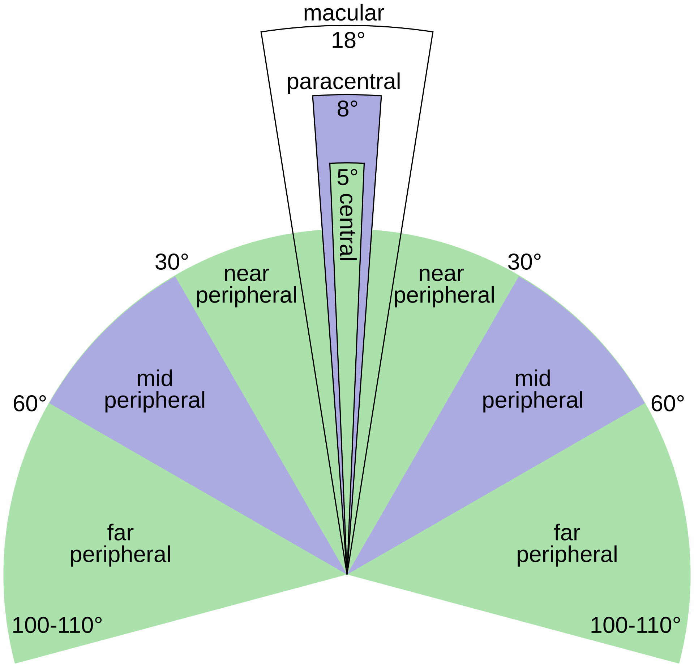

Although our eyes can see entire things our sight can see, our vision can only focus on a small part of an area. This is what we call **paracentral vision**. Paracentral vision is narrow, extending from 10 to 20 degree from the center of gaze. 

In contrast, peripheral vision is the ability to see objects or movement outside your direct line of sight, out the corner of the eyes without moving your head. Peripheral vision helps us to stay aware of the surroundings, avoid physical obstacles, safer driving, and prevents tripping when running.

