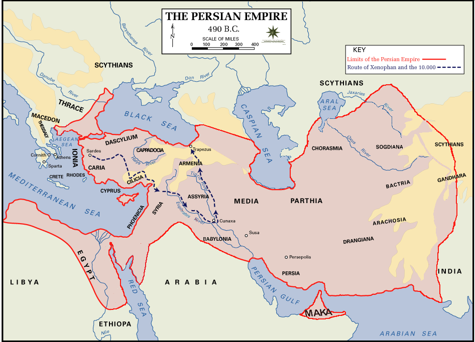

Persian empire that we refers to is **Achaemenid Empire**. It was established around 550-330 BC and was the largest Persian empire, ruled over 44% of world population at that time. Persian empire covered territory across parts of modern day Iran, Egypt, Turkiye, Afghanistan, Pakistan, Armenia, Azerbaijan, Georgia, parts of Levant and Arabian peninsula, Turkmenistan, Tajikistan, Uzbekistan, and many more part of countries.

Founded by Cyrus the Great, he gained power and expanded the empire into many territories. He led by giving religious and cultural tolerance. They allow the people to stay with their culture and religion and not abolish their culture to change it with theirs. He presented himself as a restorer of order by the local god Marduk, instead of a foreign conqueror. He could embrace and gather everyone into one with consent.

He built the empire with cooperation instead of terror. That's why Babylon fell with minimal violence. He defeated and befriending the king he defeated. He wanted to be remembered as a merciful and wise.
