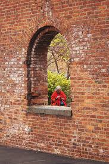
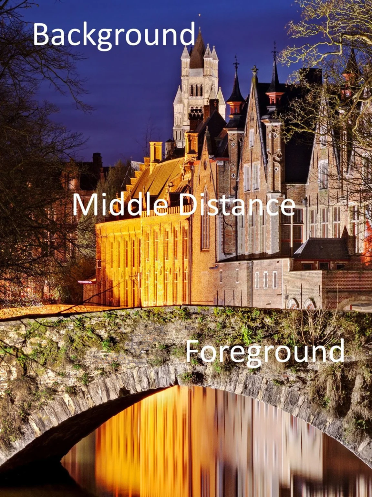

1. Centered Symmetry

The left and the right side is symmetrical.

2. Fill the frame

Put the object in the whole frame.

3. Frame within frame

There is an object in a frame.

4. Leading lines

Helps the viewer to view the photo. Anything from path, wall, or lines that can be used to guide attention.

5. Leave negative space

Make the object contrast to the background.

6. Foreground-midground-background

Add a sense of depth in the photo.

