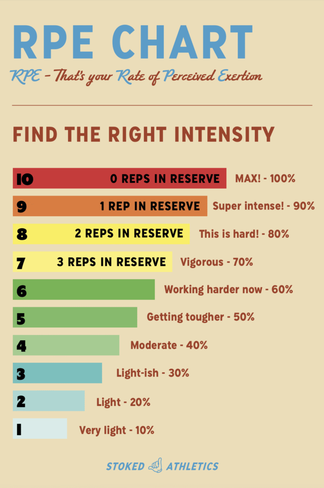

Rate of Perceived Exertion (RPE) is the way to measure how hard our body work during workout. RPE is one of the best tool to track our effort to ensure we stay in the sweet spot. To measure RPA, we use the scale from 1 to 10.

