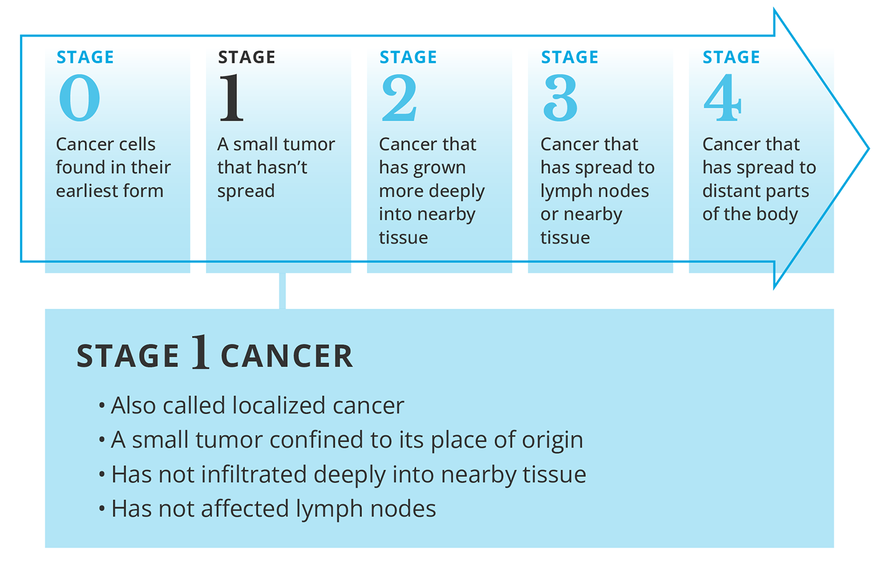

Kanker disebabkan oleh zat karsinogenik (senyawa karsinogen) yang dapat merusak sel DNA di dalam tubuh.

Contoh karsinogen:
- Penyakit/virus: Herpes, HPV, Hepatitis
- Makanan: makanan gosong, pengawet
- Lifestyle: merokok
- Industri: asbes, vinyl paint

Kanker berawal dari sel yang sehat, tapi ketika aktivitas dalam sel terganggu, metabolisme tubuh turun tangan untuk menghandle sel tersebut. Jika sel yang rusak itu sudah hopeless, mereka dapat bunuh diri (apoptosis) lalu digantikan dengan cell yang baru.

Tapi jika cell yang rusak itu tidak dapat apoptosis, mereka akan berakumulasi dan membentuk clout sehingga terbentuklah tumor. Sel yang rusak itu akan terus menyebar dan bermutasi. 

Sel sel tersebut akan bergerak through the blood vessels. Ketika sel kanker itu traveling, banyak dari mereka akan diserang oleh immune system dan tidak survive.

### Stages of cancer

