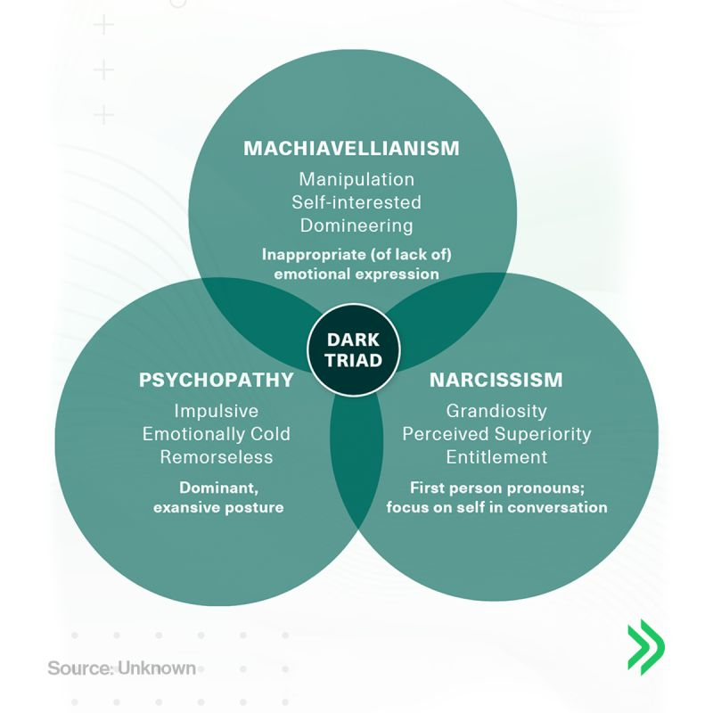

The three traits described in The Dark Triad are **Narcissism, Machiavellianism, Psychopathy**. These traits are considered dark because each is considered to have harmful characteristics. They are grouped as "The Dark Triad" due to the same behavior pattern and similar social impact. 

Among the big [five personality traits](https://en.wikipedia.org/wiki/Big_five_personality_traits) (*Openness, Conscientiousness, Extraversion, Agreeableness, Neuroticism*), the dark triad is correlated by low agreeableness and lack of conscientiousness.

### Narcissism

People who are narcissist are high in self-regard (*penghargaan diri*), arrogance, and ego. They are self-centered who think they are the main character in the world. They display **grandiosity** (exaggerated sense of superiority), entitlement, and dominance. 

Narcissism correlate positively with *extraversion* and *openness*, but lack of *agreeableness*.

Extreme narcissist can be emotionally abusive and violent if they're not given the special treatment they expect.

**How to spot a narcissist**:

- Always talk about themselves
- Exaggerating their achievements 
- Believe they deserve special treatments
- Admiration-seeker
- Tend to be anti-critic and responds with rage and defensiveness

### Machiavellianism

This personality trait is ascribed to **manipulative personality** who deceive to achieve their goals, motivated by self-interest. It is named after Niccolò Machiavelli because of his famous work *The Prince* (1532) that highlights pragmatic, ruthless, and manipulative tactics to gain power.

They are a strategist who would do anything to achieve their goals. They look interesting in hindsight but manipulative.

Different from narcissist, machiavelian tend to be calm and not doing anything aggressive, but they manipulate people psychologycally.

**How to spot a machiavellian:**

- They have cold, calculative, and manipulative behavior in focus of gaining power, money, or status, or anything they want. 
- They are skilled liars "*pembohong handal*" who often acts as "**puppet master**" who use charm and deception to control situation. 
- They use charm, invent a strategic vulnerability to make you feel special
- Using "the favor trap" when they offer help first and expecting repayment later. 
- They rarely moved by other emotions and keep a cold demeanor to stay focused on their objectives.

### Psychopathy

Psychopathy is considered to be the **"darkest" trait** in the dark triad. They lack empathy and remorse. They have low level of empathy and high level of impulsivity and thrill-seeking.

They don't care with other's feelings and well-being even their safety.

**How to spot a psychopath**:

- Irresponsibility
- Showing lack of empathy
- Feeling superior
- Impulsive, they act without considering the consequences
