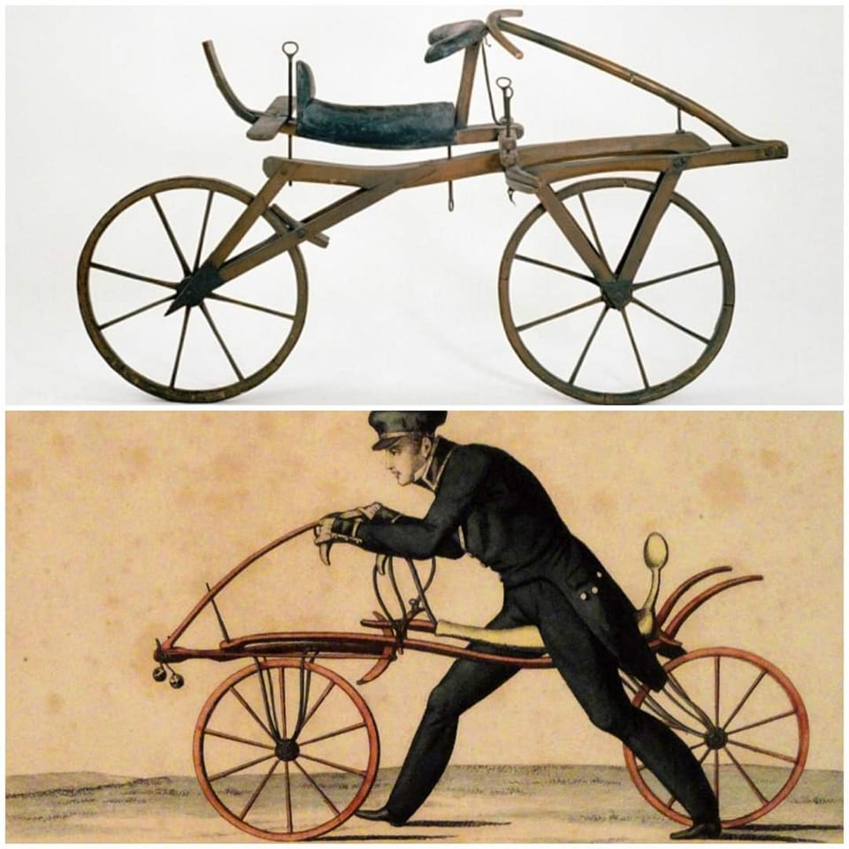

The bicycle was invented by Karl von Drais in Germany around 1817, originally named *Laufmaschine* (meaning "running machine"). It could run 14 kilometres in under an hour on flat ground. Unlike modern bicycles, the Laufmaschine had neither pedals nor chain. Instead, riders propelled it forward by pushing their feet against the ground.

