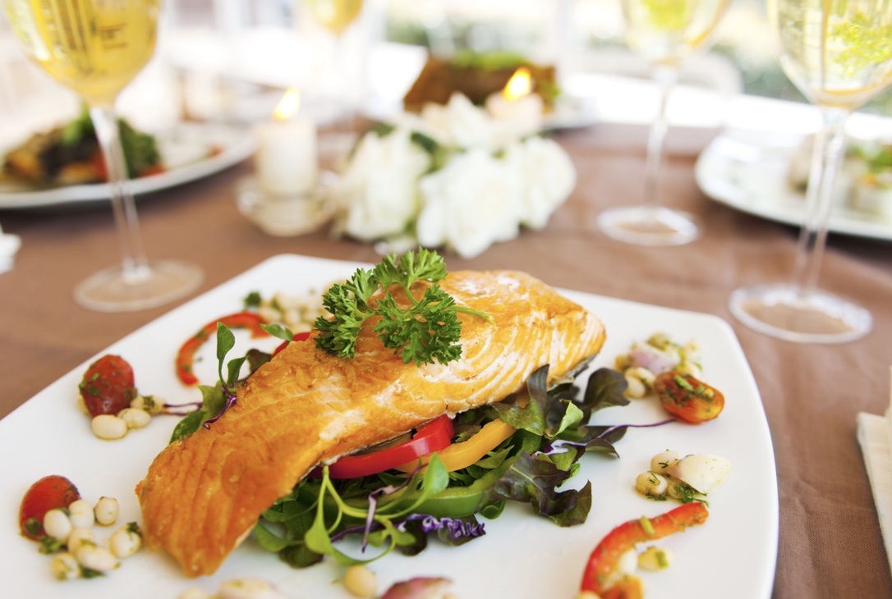

Two word: **psychological impact**. It stimulates appetite and improves perceived quality of the food. A visually appealing plate, especially with distinct colors signals craftmanship and care to the diner. It enhances the overall dining experience.

_The eyes eat first._

